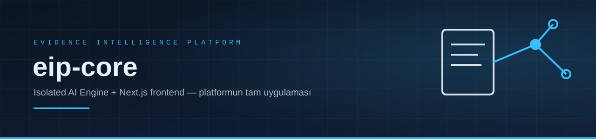
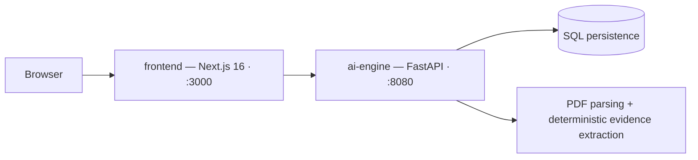

<div align="center">

</div>

# EIP Core Repository (`eip-core`)

This repository contains the full platform implementation for the **Evidence Intelligence Platform (EIP)**, comprising the Isolated Intelligence Zone AI Engine and the Next.js Web Frontend.

**What does it do?** EIP is an evidence-based hiring platform: a candidate uploads a resume (with explicit consent), the AI engine extracts *verifiable evidence* from it deterministically, and an employer sees an **explainability report** — which claims are backed by evidence, at what percentage, and why — instead of a black-box score. Employers post job requirements and accept/decline applications from a live dashboard; every AI inference is gated behind consent and an internal Zero Trust API boundary.

---

## 🏗️ Repository Architecture

```
eip-core/
├── ai-engine/      # Python 3.11 / FastAPI — Isolated Intelligence Zone
└── frontend/       # Next.js 16 / React 19 / TypeScript — Public Web Interface
```



### 1. AI Engine (`/ai-engine`)
- **Framework:** FastAPI + SQLModel + Google GenAI SDK
- **Port:** `8080`
- **Docs:** `http://localhost:8080/docs`
- **Key Responsibilities:** Deterministic evidence extraction, PDF parsing, Zero Trust API authentication, SQL persistence.

### 2. Frontend (`/frontend`)
- **Framework:** Next.js 16.2.10 (App Router) + React 19.2.4 + Tailwind CSS 4 + TypeScript
- **Port:** `3000`
- **Key Views:**
  - Employer Dashboard (`/employer/dashboard`)
  - Candidate Evidence Hub (`/candidate/hub`)
  - Candidates Directory (`/candidates`)
  - Candidate Detail View (`/candidates/[id]`)
  - Explainability Report View (`/reports/[id]`)
  - Requirements Directory (`/requirements`)

---

## ⚡ Quick Start

### 1. Run AI Engine
```bash
cd ai-engine
python -m venv venv

# Activate — pick the line for your platform:
venv\Scripts\activate       # Windows
source venv/bin/activate    # Linux/macOS

pip install -r requirements.txt
cp .env.example .env        # ai-engine/.env.example — see note below
uvicorn src.main:app --reload --port 8080
```

Open `.env` and set at least `INTERNAL_API_KEY` and `JWT_SECRET_KEY` (the file
shows the one-liner that generates each). `GEMINI_API_KEY` is needed only for
evidence extraction; everything else runs without it.

> **Two `.env.example` files, on purpose.** `ai-engine/.env.example` lists the
> variables the engine itself reads and is the one to copy for a direct
> `uvicorn` run. The repository root's `.env.example` configures
> `docker compose up` — it also carries `POSTGRES_PASSWORD` and the frontend's
> `EIP_*` variables, and compose passes the engine's values into the container.
> Copy the root one only when running the full stack through Docker.

### 2. Run Frontend
```bash
cd frontend
npm install
npm run dev
```

The frontend reaches the engine through a server-side proxy, so it needs
`EIP_API_URL` and `EIP_INTERNAL_API_KEY` (matching the engine's
`INTERNAL_API_KEY`) in `frontend/.env.local`. The internal key never reaches
the browser.

---

## 🧪 Running Tests

```bash
# Backend
cd ai-engine
venv\Scripts\python.exe -m pytest tests/ -q

# Frontend
cd frontend
npm test          # Vitest
npx tsc --noEmit  # type check
```

---

## 🔒 Governance & Security Compliance
Refer to the `eif-core-docs` repository for constitutional rules (`01_ENGINEERING_CONSTITUTION.md`), database schemas (`05_DATABASE_SCHEMA.md`), and security architecture (`08_SECURITY_ARCHITECTURE.md`).
